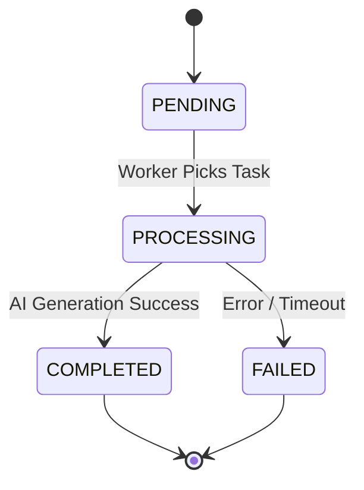

# AI Fashion Studio

AI Fashion Studio is an advanced platform that leverages Generative AI to design, visualize, and modify fashion outfits. This project allows users to generate custom clothing designs, combine various styles, and see them visualized on virtual models.

## Project Overview & Architecture

```text
+----------------+     +-------------------+     +------------------+
|                |     |                   |     |                  |
|  Next.js (UI)  | <-> |  FastAPI Backend  | <-> |  Celery Worker   |
|                |     |                   |     |                  |
+----------------+     +---------+---------+     +---------+--------+
                                 |                         |
                                 v                         v
                       +---------+---------+     +---------+--------+
                       |                   |     |                  |
                       |    PostgreSQL     |     |   Redis (Cache   |
                       |    (Database)     |     |   & Msg Broker)  |
                       +-------------------+     +------------------+
                                 |                         |
                       +---------+---------+     +---------+--------+
                       |                   |     |                  |
                       |       MinIO       |     |   AI Providers   |
                       |    (S3 Storage)   |     | (Gemini, Vertex) |
                       +-------------------+     +------------------+
```

## Prerequisites

- **Docker & Docker Compose**: For running the entire stack locally.
- **Node.js 18+**: If running the frontend locally for development.
- **Python 3.11+**: If running the backend locally for development.

## Quick Start (Docker Compose)

1. Clone the repository and navigate to the project directory.
2. Copy the example environment file:
   ```bash
   cp .env.example .env
   ```
3. Update `.env` with your actual credentials (e.g., Google API keys).
4. Build and start the services:
   ```bash
   docker-compose up --build
   ```
5. Access the application:
   - Frontend: `http://localhost:3000`
   - Backend API Docs: `http://localhost:8000/docs`
   - MinIO Console: `http://localhost:9001` (Credentials: minioadmin/minioadmin)

## Development Setup

### Frontend Development

```bash
cd frontend
npm install
npm run dev
```

### Backend Development

```bash
cd backend
python -m venv venv
source venv/bin/activate  # On Windows: venv\Scripts\activate
pip install -r requirements.txt
uvicorn app.main:app --reload
```

## Environment Variables

| Variable | Description | Default |
|----------|-------------|---------|
| `POSTGRES_PASSWORD` | PostgreSQL user password | `fashion_pass` |
| `MINIO_ROOT_USER` | MinIO admin user | `minioadmin` |
| `MINIO_ROOT_PASSWORD`| MinIO admin password | `minioadmin` |
| `SECRET_KEY` | JWT/Security key | `change-this...` |
| `GOOGLE_API_KEY` | Gemini API Key | - |
| `NEXT_PUBLIC_API_URL`| API Base URL for Frontend | `http://localhost:8000/api/v1` |

## API Overview

| Endpoint | Method | Description |
|----------|--------|-------------|
| `/api/v1/auth/login` | POST | Authenticate user |
| `/api/v1/designs/` | GET | List user designs |
| `/api/v1/designs/generate`| POST | Start a new AI generation task |
| `/api/v1/tasks/{id}` | GET | Get generation status |

## Key Features

- **AI-Powered Generation**: Create unique clothing items based on text prompts.
- **Async Processing**: Fast UI response while heavy AI generation runs in the background via Celery.
- **Scalable Architecture**: Dockerized services ensuring uniform environments from dev to prod.
- **Object Storage**: High-performance image and asset storage using MinIO (S3-compatible).
- **Extensible AI Providers**: Easy-to-extend abstraction layer for plugging in new AI models.

## Architecture Highlights

1. **Frontend**: Next.js 14+ providing a reactive UI.
2. **API Layer**: FastAPI handles incoming HTTP requests, user authentication, and data validation.
3. **Services Layer**: Manages business logic and orchestrates background jobs.
4. **Providers**: Abstraction over external APIs (e.g., Google Gemini).
5. **Validation**: Pydantic models ensure strong typing and data integrity across the system.

## Database Schema Overview

- **Users**: Authentication and profile data.
- **Designs**: Metadata, prompts, and storage paths for generated outfits.
- **Tasks**: Tracking background Celery jobs (status, result, errors).

## Generation State Machine



## Provider Abstraction

The system uses an abstract base class `BaseAIProvider`. To add a new provider:
1. Inherit from `BaseAIProvider`.
2. Implement the `generate_image()` and `modify_image()` async methods.
3. Register the provider in the provider factory.

## Updating Prompt Templates

Prompt templates are stored in `backend/app/core/prompts.py` (or similar). Modify these templates to tweak the instructions sent to the AI models for better output quality.
